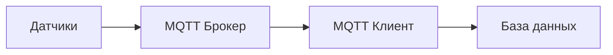

# 🏗️ Система геотехнического мониторинга

Веб-приложение для мониторинга технического состояния зданий и сооружений в режиме реального времени с использованием датчиков различных типов и математической обработки данных.


## 📋 Обзор системы

Система предназначена для непрерывного контроля технического состояния зданий через сеть датчиков, установленных в ключевых точках конструкций. Данные с датчиков обрабатываются в реальном времени, анализируются с помощью математических методов и визуализируются в удобном веб-интерфейсе.

### 🎯 Основное назначение

- **Раннее обнаружение** структурных изменений в зданиях
- **Мониторинг безопасности** в режиме реального времени  
- **Прогнозирование** потенциальных проблем через анализ трендов
- **Ведение истории** показаний для долгосрочного анализа
- **Автоматические уведомления** при превышении критических значений

## 🏛️ Архитектура системы

### Backend (Python Flask)
```
server/
├── app.py                 # Главное приложение Flask
├── config.py              # Конфигурация системы
├── api/                   # REST API эндпоинты
├── models/                # Модели данных (SQLAlchemy)
├── services/              # Бизнес-логика
├── mqtt/                  # MQTT клиент для датчиков
├── utils/                 # Вспомогательные утилиты
└── database/              # Управление базой данных
```

### Frontend (React)
```
client/
├── src/
│   ├── components/        # React компоненты
│   ├── services/          # API клиенты
│   └── styles/            # CSS стили
├── public/                # Статические файлы
└── package.json           # Зависимости npm
```

### База данных (SQLite)
- **Здания** - информация об объектах мониторинга
- **Датчики** - каталог установленных измерительных устройств
- **Показания** - временные ряды данных с датчиков
- **Настройки тревог** - пороговые значения для каждого типа датчика

## 🔧 Технологический стек

### Серверная часть
| Технология | Версия | Назначение |
|------------|--------|------------|
| **Python** | 3.8+ | Основной язык backend |
| **Flask** | 3.1.1 | Веб-фреймворк |
| **SQLAlchemy** | 3.1.1 | ORM для работы с БД |
| **SQLite** | - | Реляционная база данных |
| **Scikit-learn** | 1.6.1 | Машинное обучение и аппроксимация |
| **NumPy** | 2.2.6 | Математические вычисления |
| **Paho MQTT** | 2.1.0 | Протокол связи с датчиками |
| **Flask-CORS** | 5.0.1 | Кросс-доменные запросы |

### Клиентская часть  
| Технология | Версия | Назначение |
|------------|--------|------------|
| **React** | 18+ | Пользовательский интерфейс |
| **React Router** | 6+ | Маршрутизация |
| **Chart.js** | 4.4.0 | Графики и визуализация |
| **React Bootstrap** | 2.9.1 | UI компоненты |
| **Axios** | 1.6.2 | HTTP клиент |
| **Date-fns** | 4.1.0 | Работа с датами |

### Инфраструктура
| Компонент | Назначение |
|-----------|------------|
| **Mosquitto MQTT** | Брокер сообщений для датчиков |
| **npm/Node.js** | Сборка фронтенда |
| **Python venv** | Изоляция зависимостей |

## 📊 Типы поддерживаемых датчиков

### 📐 Инклинометры
- **Измеряют:** Угол наклона конструкций
- **Единицы:** Градусы
- **Пороги тревог:** -5° до +5°
- **Применение:** Мониторинг фундаментов, стен, мостов

### 🔧 Тензометры
- **Измеряют:** Деформацию материалов
- **Единицы:** Микрометры на метр (мкм/м)
- **Пороги тревог:** -50 до +50 мкм/м
- **Применение:** Контроль напряжений в балках, колоннах

### 📳 Акселерометры
- **Измеряют:** Вибрации и ускорения
- **Единицы:** Миллиметры в секунду в квадрате (мм/с²)
- **Пороги тревог:** До 20 мм/с²
- **Применение:** Мониторинг вибраций от транспорта, оборудования

### 🔍 Датчики трещин
- **Измеряют:** Ширину раскрытия трещин
- **Единицы:** Миллиметры (мм)
- **Пороги тревог:** До 5 мм
- **Применение:** Контроль развития трещин в стенах, перекрытиях

### 🌡️ Датчики температуры
- **Измеряют:** Температуру конструкций
- **Единицы:** Градусы Цельсия (°C)
- **Пороги тревог:** -30°C до +80°C
- **Применение:** Мониторинг температурных деформаций

## 🔄 Принцип работы системы

### 1. Сбор данных


- Датчики отправляют показания через **MQTT протокол**
- Данные поступают в формате JSON с временными метками UTC
- **Автоматическая проверка** на превышение пороговых значений
- **Мгновенное сохранение** в базу данных SQLite

### 2. Математическая обработка

#### Полиномиальная аппроксимация
- **Степени полинома:** 2-5 (автоматический выбор оптимальной)
- **Библиотека:** Scikit-learn с PolynomialFeatures
- **Метрика качества:** Коэффициент детерминации R²
- **Сглаживание:** Устранение шумов в данных датчиков

#### Анализ трендов
- **Определение направления:** Рост, снижение, стабильность  
- **Количественная оценка:** Процент изменения за период
- **Классификация силы тренда:** Слабый, умеренный, сильный
- **Временные окна:** От 1 часа до нескольких недель

### 3. Система тревог
```python
# Пример логики определения тревоги
def check_alert(sensor_type, value):
    config = get_alert_config(sensor_type)
    
    if config.min_threshold and value < config.min_threshold:
        return True, "Значение ниже минимального порога"
    
    if config.max_threshold and value > config.max_threshold:
        return True, "Значение выше максимального порога"
        
    return False, "Значение в норме"
```

### 4. Веб-интерфейс

#### Дашборд
- **Обзор всех зданий** под мониторингом
- **Статистика по датчикам** (активные, в тревоге)
- **Список активных тревог** с возможностью детализации
- **Навигация по объектам** мониторинга

#### Детали здания
- **Информация об объекте** (адрес, тип, этажность)
- **Список всех датчиков** здания с последними показаниями
- **Общий статус** объекта (норма/требует внимания)
- **Переходы к детальному анализу** каждого датчика

#### Анализ датчика
- **Интерактивные графики** с исходными данными и аппроксимацией
- **Настройки анализа** (период, степень полинома)
- **Анализ трендов** с количественными показателями
- **Автообновление в реальном времени**

## 🚀 Установка и запуск

### Предварительные требования
```bash
# Системные зависимости
- Python 3.8+
- Node.js 14+
- npm 6+
- Mosquitto MQTT Broker
```

### 1. Установка MQTT брокера

#### Ubuntu/Debian
```bash
sudo apt-get install mosquitto mosquitto-clients
sudo systemctl start mosquitto
sudo systemctl enable mosquitto
```

#### macOS
```bash
brew install mosquitto
brew services start mosquitto
```

#### Windows
Скачать с [официального сайта](https://mosquitto.org/download/)

### 2. Настройка серверной части

```bash
# Клонирование репозитория
git clone https://github.com/username/geo_monitoring_ver3.0.git
cd geo_monitoring_ver3.0

# Создание виртуального окружения
python -m venv env

# Активация окружения
source env/bin/activate  # Linux/Mac
# или
env\Scripts\activate     # Windows

# Установка зависимостей
pip install -r requirements.txt

# Запуск сервера
python -m server.app
```

### 3. Настройка клиентской части

```bash
# Переход в директорию клиента
cd client

# Установка зависимостей
npm install

# Запуск в режиме разработки
npm start
```

### 4. Инициализация данных

```bash
# Создание тестовых данных
curl http://localhost:5000/init-sample-data
```

### 5. Запуск симулятора датчиков

```bash
# Симуляция данных с датчиков
python sensors_simulator.py --interval 1
```

## 🎛️ Конфигурация системы

### server/config.py
```python
# Основные настройки
DEBUG = True
SECRET_KEY = 'your-secret-key'

# База данных  
SQLALCHEMY_DATABASE_URI = 'sqlite:///geo_monitoring.db'

# MQTT
MQTT_BROKER_HOST = 'localhost'
MQTT_BROKER_PORT = 1883

# API
API_PREFIX = '/api/v1'
```

### Настройки тревог
```python
# Пример конфигурации для инклинометра
AlertConfig(
    sensor_type='инклинометр',
    min_threshold=-5.0,    # Минимальный угол наклона
    max_threshold=5.0,     # Максимальный угол наклона  
    unit='градусы'
)
```

## 📡 API интерфейс

### Основные эндпоинты

#### Здания
```http
GET /api/v1/geo/buildings
GET /api/v1/geo/buildings/{id}
```

#### Датчики
```http
GET /api/v1/geo/sensors
GET /api/v1/geo/sensors/{id}
GET /api/v1/geo/sensors/{id}/readings?hours=24
```

#### Аппроксимация
```http
GET /api/v1/geo/sensors/{id}/approximation?hours=24&degree=3&points=50
GET /api/v1/geo/sensors/{id}/trend?hours=24
```

#### Тревоги
```http
GET /api/v1/geo/alerts?hours=24
```

### Пример ответа API
```json
{
  "sensor_id": 1,
  "approximation_data": {
    "original_data": [
      {
        "timestamp": "2025-06-14T10:00:00Z",
        "value": 1.23
      }
    ],
    "approximation": [
      {
        "timestamp": "2025-06-14T10:00:00Z", 
        "value": 1.25
      }
    ],
    "quality_metrics": {
      "method": "polynomial",
      "degree": 3,
      "r_squared": 0.94,
      "num_original_points": 144
    }
  },
  "trend_analysis": {
    "trend": "increasing",
    "description": "Рост показаний за час (+2.1%)",
    "change_percent": 2.1,
    "start_value": 1.20,
    "end_value": 1.23
  }
}
```

## 🌐 MQTT протокол

### Структура топиков
```
geo/sensors/{sensor_type}/{sensor_id}/data
```

### Формат сообщений
```json
{
  "value": 12.34,
  "unit": "мм/с²", 
  "timestamp": "2025-06-14T10:30:00Z"
}
```

### Примеры топиков
```
geo/sensors/инклинометр/1/data
geo/sensors/тензометр/2/data  
geo/sensors/акселерометр/3/data
```

## 🎨 Пользовательский интерфейс

### Главный дашборд
- **Карточки зданий** с основной информацией
- **Счетчики активных тревог** и общей статистики
- **Быстрый доступ** к детальной информации
- **Адаптивная верстка** для мобильных устройств

### Страница здания  
- **Подробная информация** об объекте мониторинга
- **Список всех датчиков** с последними показаниями
- **Индикаторы статуса** (норма, тревога, обслуживание)
- **Навигация к анализу** отдельных датчиков

### Анализ датчика
#### Интерактивный график
- **Исходные данные** - точки показаний датчика
- **Аппроксимация** - жирная красная линия тренда
- **Временная шкала** с возможностью масштабирования
- **Всплывающие подсказки** с точными значениями

#### Панель настроек
- **Период анализа:** 1 час - 1 неделя
- **Степень полинома:** 2-5 или автоматический выбор
- **Автообновление:** 1-60 секунд
- **Навигация:** быстрые переходы по странице

#### Анализ трендов
- **Направление изменений** с иконками (↗️ ↘️ ➡️)
- **Количественная оценка** в процентах
- **Качество аппроксимации** (коэффициент R²)
- **Предупреждения** при критических изменениях

## 🔍 Диагностические утилиты

### check_database.py
```bash
python check_database.py
```
- Проверка существования и целостности базы данных
- Статистика по количеству записей
- Анализ распределения данных по времени
- Автоматическая инициализация при необходимости

### test_mqtt.py  
```bash
python test_mqtt.py
```
- Тестирование подключения к MQTT брокеру
- Отправка тестовых сообщений
- Проверка получения данных
- Диагностика проблем соединения

## ⚡ Производительность и масштабирование

### Оптимизация запросов
- **Индексы** на полях timestamp и sensor_id
- **Ограничение выборки** по времени и количеству записей
- **Кеширование** статических данных о датчиках
- **Пагинация** для больших объемов данных

### Масштабирование данных
- **Автоматическая очистка** старых записей
- **Сжатие исторических данных** 
- **Репликация базы данных** для высокой доступности
- **Горизонтальное масштабирование** MQTT брокеров

### Производительность интерфейса
- **Ленивая загрузка** компонентов React
- **Мемоизация** тяжелых вычислений
- **Виртуализация** длинных списков
- **Оптимизация графиков** Chart.js

## 🔒 Безопасность

### Аутентификация
- JWT токены для API (в планах)
- Ролевая модель доступа (в планах)
- Ограничения по IP адресам

### Защита данных
- **Валидация входных данных** на уровне API
- **Санитизация** пользовательского ввода  
- **Шифрование** чувствительных данных
- **Резервное копирование** базы данных

### MQTT безопасность
- Аутентификация клиентов (в планах)
- TLS шифрование (в планах)
- Ограничения топиков по ролям

## 📊 Мониторинг и логирование

### Системные логи
```python
# Настройка логирования
logging.basicConfig(
    level=logging.INFO,
    format='%(asctime)s - %(name)s - %(levelname)s - %(message)s',
    handlers=[
        logging.FileHandler('geo_monitoring.log'),
        logging.StreamHandler()
    ]
)
```

### Метрики системы
- **Количество активных датчиков**
- **Частота поступления данных**  
- **Время отклика API**
- **Использование памяти и CPU**

### Мониторинг тревог
- **История срабатываний** тревог
- **Статистика по типам** датчиков
- **Анализ ложных** срабатываний
- **Отчеты по периодам**

## 🤝 Интеграция с внешними системами

### ERP системы
- REST API для получения данных мониторинга
- Экспорт отчетов в форматах Excel, PDF
- Интеграция с системами уведомлений

### Системы автоматизации зданий (BMS)
- Передача данных о состоянии конструкций
- Интеграция с системами безопасности
- Автоматическое управление по тревогам

### Геоинформационные системы (ГИС)
- Привязка датчиков к координатам
- Отображение на картах
- Пространственный анализ данных

## 📱 Мобильная поддержка

### Адаптивный дизайн
- **Bootstrap responsive grid** для всех экранов
- **Оптимизированные графики** для мобильных устройств
- **Touch-friendly** элементы управления
- **Быстрая загрузка** на медленных соединениях

### PWA возможности (в планах)
- Работа в офлайн режиме
- Push уведомления
- Установка как приложение
- Синхронизация при восстановлении соединения

## 🔮 Планы развития

### Машинное обучение
- **LSTM сети** для более точного прогнозирования
- **Детекция аномалий** на основе ИИ
- **Кластеризация** типовых паттернов поведения
- **Автоматическая калибровка** порогов тревог

### Визуализация
- **3D модели зданий** с размещением датчиков
- **Тепловые карты** состояния конструкций
- **Виртуальная реальность** для осмотра объектов
- **Дополненная реальность** для мобильных инспекций

### Интеграция
- **IoT платформы** (AWS IoT, Azure IoT)
- **Облачные аналитические сервисы**
- **Системы видеонаблюдения**
- **Дроны для визуального контроля**

## 📞 Поддержка

### Документация
- **API документация** в формате OpenAPI/Swagger
- **Руководство администратора** по настройке
- **Руководство пользователя** по работе с интерфейсом
- **Примеры интеграции** с различными типами датчиков

### Техническая поддержка
- **GitHub Issues** для сообщений об ошибках
- **Wiki** с часто задаваемыми вопросами
- **Форум сообщества** для обсуждений
- **Коммерческая поддержка** для enterprise клиентов

---

**Система геотехнического мониторинга** - это комплексное решение для обеспечения безопасности зданий и сооружений через непрерывный контроль их технического состояния с использованием современных технологий сбора, обработки и анализа данных.